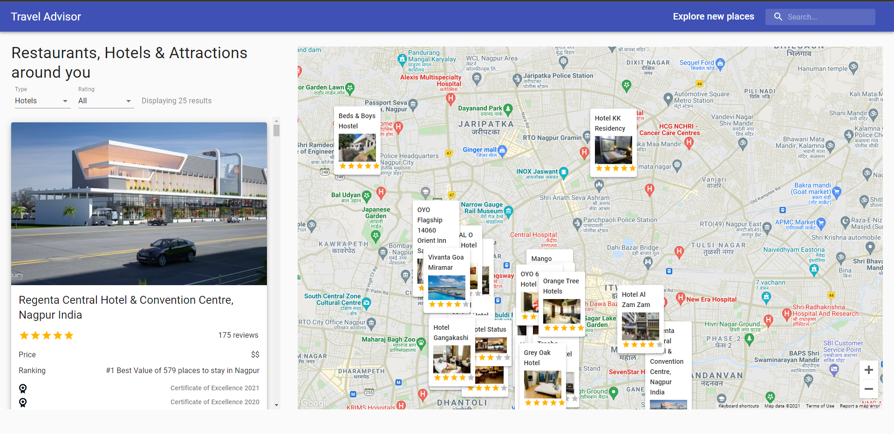

TripBuddy
==============  

[Live Website](https://pushkarra.github.io/tripbuddyapp/)

Identification of problem: -
The main problem is that offline system does not provide useful information for user to explore the system. This problem causes users to spend a lot of time deciding where to go and worrying about which places are worth going. Many tourists choose to trust her travel agency, usually found on the Internet. However, there is always risk in trusting someone behind the scenes at. Tourists can be tricked by irresponsible fortune-seekers. Food service and finding best restaurants and hotels is also one of the major problems during travelling.1.  **Trip Buddy** is a mobile application that allows users to identify the problem and solve it.

Proposed Solution: -
The proposed application was designed and implemented by the React and google map API. The proposed tourism system will be able to provide the tourists with recommendations for places to visit based on their preferences. TripBuddy is an advanced Travel Companion Application using Google Maps. With Geolocation, Google Maps API, Searching for places, Fetching restaurants, hotels and attractions based on location from specialized Rapid APIs, data filtering and much more.

